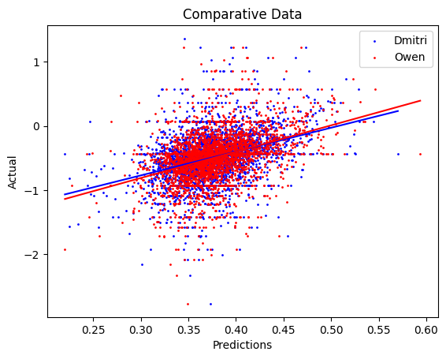

# Predicting Gene Expression Rates Using Custom Tokenizer

This repository showcases a project leveraging machine learning techniques to predict gene expression rates from DNA sequences. At its core, the project utilizes a custom-built tokenizer to segment and encode sequences into motifs, followed by predictive modeling to analyze repression rates.

***

## Overview

### Problem Statement

Given the **motif composition** of a DNA sequence, we aim to predict its repression rate. This involves:

- Segmenting DNA sequences into motifs with a tokenizer.

- Correlating motif composition with repression rate.

- Experimenting with transformer models for prediction.

### Highlights

- **Custom Tokenizer:** A tokenizer built to identify and encode motifs within DNA sequences.

- **Transformer Experimentation:** Models like DNABERT2 were explored for fine-tuning and training on DNA motifs.

- **Correlation Analysis:** Models assessed using metrics such as Mean Squared Error (MSE), Root Mean Squared Error (RMSE), and R².

***

## Methodology

### Data

The project utilizes sequence data with motif compositions and expression rates:

| **ID**    | **1h** | **2h** | **3h** | **4h** | **5h**  | **6h**   | **7h**   | **8h**   | **10h**  |
| --------- | ------ | ------ | ------ | ------ | ------- | -------- | -------- | -------- | -------- |
| S0\_M\_T1 | 1.1502 | 1.1256 | 1.4005 | 0.2332 | 0.73195 | -0.47038 | -0.57411 | -0.25983 | -0.76564 |

### Tokenizer

The custom tokenizer transforms sequences into motifs:

- **Segmentation Example:**

  - Input Sequence: `GGGTCCCCCTGACAG`

  - Tokenized Output: `[GGG], [TCCCCCT], [GACAG]`

- **Sliding Window Mechanism:**

  - Input Sequence: `TGTCCCCGGGTCTT`

  - Sliding Window Output: `[TGTCCCC, TCCCCGG, ...]`

***

## Experiments

### Transformer Models

#### DNABERT2

- Pretrained large language model for sequence prediction.

- Achieved R² = 0.457. 

#### Custom Morphological Segmentation (DNA-MORPH)

- **Model Variants:**

  - MORPH\_D: Fine-tuned on Dmitri data.

  - MORPH\_O: Fine-tuned on Owen data.

  - DNABERT2: Utilized DNABERT2 Model.

### Comparison with Canonical Models

|           |         |         |          |        |
| --------- | ------- | ------- | -------- | ------ |
| **Model** | **MSE** | **MAE** | **RMSE** | **R²** |
| DNABERT2  | 0.092   | 0.216   | 0.304    | 0.457  |
| MORPH\_D  | 0.144   | 0.265   | 0.379    | 0.174  |
| MORPH\_O  | 0.141   | 0.261   | 0.375    | 0.178  |

***

## Results

The custom tokenizer demonstrated potential for identifying meaningful motifs. Transformer-based models showed varying success, with DNABERT2 achieving the highest correlation to repression rates.

Below is a figure comparing the correlations of MORPH_D and MORPH_O. 

This is compared to DNABERT2 in green, which outperforms both models and shows a much higher correlation. 

***

## Installation

1. Clone this repository:

       git clone https://github.com/SamuelTWu/Sequence-Expression-LMM.git

2. Install the required dependencies:

       pip install -r requirements.txt

3. Run the notebooks:

       jupyter notebook

***

## Usage

1. **Data Preparation:**

   - Ensure sequence data is formatted appropriately.

2. **Tokenization:**

   - Run the tokenizer notebook to preprocess sequences.

3. **Prediction:**

   - Use the models provided to predict repression rates.

***

## Future Work

- Optimization of the custom tokenizer.

- Exploration of additional transformer architectures.

- Improved correlation analysis and motif ranking methods.

***

## License

This project is licensed under the MIT License. See the `LICENSE` file for details.

***

## Acknowledgments

- Inspiration and guidance from **Machine Learning in Microbiology** concepts.

- Data support from Rabani Expression and Mean RBP studies.

For any questions, please contact \[[samwu@bu.edu]()].
